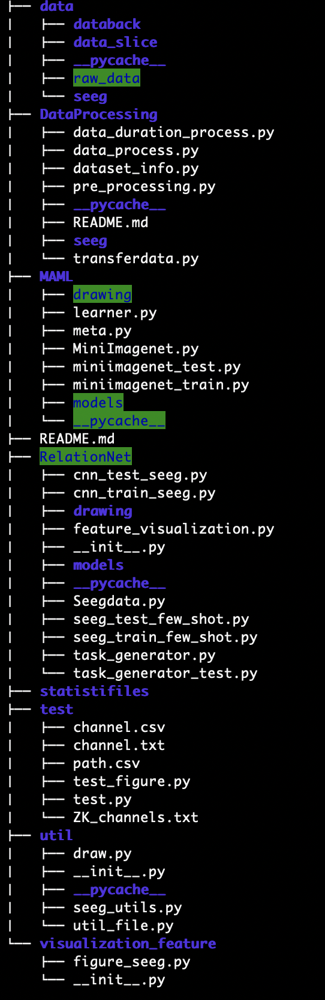

# SEEG Project

## content

**data**  There are some data about raw seeg data, processed data, and channels information.

**RelationNet**  including CNN coding, few-shot learning coding, and feature visualization methods.

**test** including testing methods

**util**  including reading .*edf file methods, and filtering methods.

**MAML** including MAML model

Project structure

